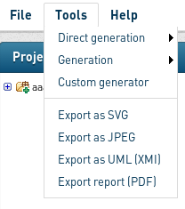
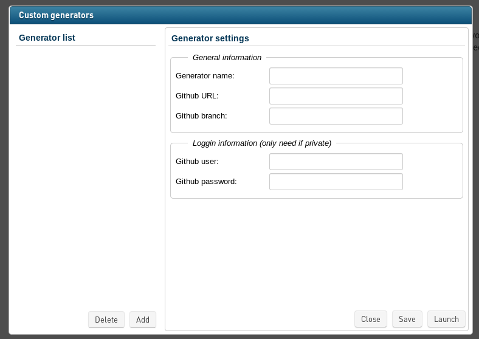
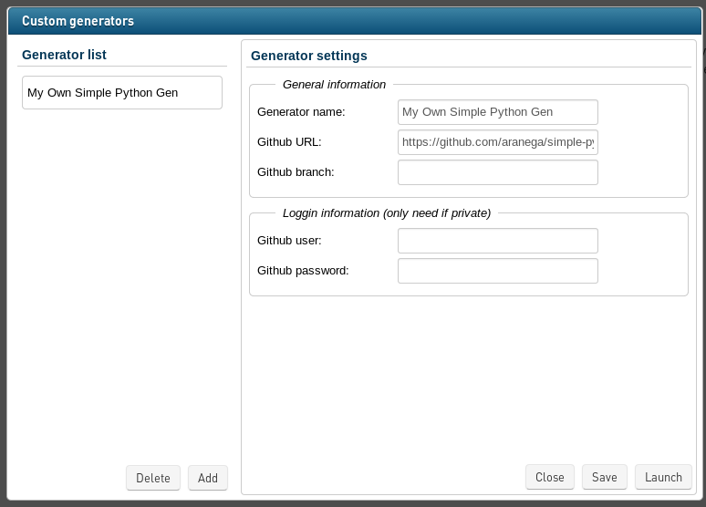
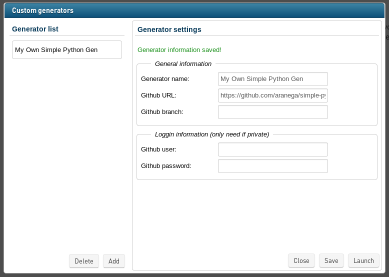

Write Your Own Generator
========================

[GenMyModel](http://wwww.genmymodel.com "GenMyModel's Homepage") brings the statement "model everywhere" to the truth by giving
you the opportunity to use your Web Browser as an UML Modeler. 

As a complement to the modeling activity, GenMyModel provides generic code generators in a one-size-fits-all fashion. Obviously, 
this kind of generators is acceptable for ones, but can be a real deal breaker for others. Many people would like  generated code 
customization to match to their framework/language/coding style. Therefore, we decide to provide you a way to create your 
own generator, upload it in the cloud and use it in GenMyModel with your UML models.

That's right, you can now build a custom generator, push it on [Github](https://github.com "Social Coding"), register it
in GenMyModel and use it everywhere.

## Build Custom Generator
The GenMyModel engine is now able to read custom generators hosted on Github and to use them in order to produce
code for your model hosted in GenMyModel. The step transforming model to code (model to text transformation, or 
M2T) is made using [Obeo](http://www.obeo.fr/ "Obeo's Homepage") [Acceleo](http://www.eclipse.org/acceleo/ "Acceleo Homepage"),
an implementation of the [OMG Model To Text Transformation Language](http://www.omg.org/spec/MOFM2T/1.0/ "MTL Homepage") (MTL), 
a language used to handle and produce text from models. 

This section is organized as follow. The first part of this section deals with code generator organization (project setup, 
required directories...). The second one present requirements for the model to text transformations. The third part of this 
section give details about the main piece of the project, the `generator.xml` file, then, the fourth part exmplains how to register your custom generator into GenMyModel. 
Finally, last part of this article presents you the errors
you could face while compiling/executing your generator.

### Code Generator Organization

A code generator project must follow this directories organization:

    Github_repository
    |-- my-generator			*Required*
    |	|-- codegen				*Required*
    |	+-- generator.xml		*Required*
    +-- README.md

* Project files (transformations...) must be included in a directory
__named after your generator__ (*e.g, if you want to create a UML to PHP generator named PHPGen, you have to include all the 
generator files in a 'PHPGen' directory in the Github repository hosting it*).
* Generator M2T files must be included __into the `codegen` directory__.
* `generator.xml` must be included __at the root__ of your project directory.

Thus a generic code generator could look like this:

    Github_repository
    |-- my-generator			*Required*
    |	|-- codegen				*Required*
    |	|   |-- subdirectory
    |	|   |	+-- files_1_1.mtl
    |	|   |-- file_1.mtl			('.mtl' are MTL transformations)
    |	|   |-- file_2.mtl
    	...
    |	|   +-- file_n.mtl
    |	+-- generator.xml		*Required*
    +-- README.md					(totally optionnal, but seriously guys...)

Here is an example of a [simple python generator](https://github.com/aranega/simple-python-gen) 
organization:

    https://github.com/aranega/simple-python-gen.git
    |-- simple-python
    |	|-- codegen
    |	|   +-- uml2python.mtl
    |	+-- generator.xml
    +-- README.md  

### From Model to Text
MTL language is a powerful language designed to generate code from any kind of models. It allows you to filter elements,
navigate from elements to others and produce text/code. MTL files are often divided in three main parts:

1. Module declaration and used metamodels registration
2. Main entry point definition
3. Templates definition

Each file is considered a MTL module and each module must be defined in its own file (*as Java classes for example*). 
Metamodel registrations setups the code generator engine to handle models that conform to them. In the GenMyModel case, handled models conform
to UML metamodel. Thus, the UML metamodel must be registered. For example, in the `uml2python.mtl` module, the metamodel is registered as follow:

    [comment encoding = UTF-8 /]
    [module uml2python('http://www.eclipse.org/uml2/4.0.0/UML')]

The first line sets the file encoding whereas the second one sets the module name and registers the UML metamodel. To put this as
a rule (in this released version), every written MTL file to be used by GenMyModel as part of a custom generator must begin with
these two lines (with the good module name). Be careful, if a module is declared with the wrong name, it cannot be 
compiled.

As in every language, if the module is to be used as main entry, a main 'template' must be declared. Technically, this is done by
adding an annotation in a MTL comment block that indicates the template must be considered as a main. For GenMyModel, this template
__has to be named 'generate'__. Here is an example (also extracted from the `simple-python-gen` generator):

    [template public generate(p : Package)]
    [comment @main/]
    [file (p.name.concat('.py'), false, 'UTF-8')]
    ...
    [/file]
    [/template]

This piece of code defines a 'generate' template (as required) and precises that the main entry is applied on UML Package instances.
The `file` block indicates that each time a UML Package will be found in an input model, a file named after the Package name suffixed 
by '.py' will be produced. __Not all generators have to consider Package as entry point type. The type of elements accepted by 
the 'generate' template could be any other UML type__.

These steps completed, you can now write your templates. Here is an example, extracted, once again, from `simple-python-gen` generator:

    [template public genClassif(e : Enumeration)]
    class [e.name/]:
    	  [if (not e.ownedComment->isEmpty())]
	  """
	  [e.ownedComment.genComment(' ')/]
	  """
	  [/if]
	  [if (not e.ownedLiteral->isEmpty())]
	  [for (lit : EnumerationLiteral | e.ownedLiteral) separator(', ')][lit.name/][/for] = range([e.ownedLiteral->size()/])
	  [/if]
    [/template] 

This template called 'genClassif' is defined for UML Enumeration instances. It generates an implementation choice for Enumerations
in Python. The first and last line are here to define the 'template'. Then, the main code is generated as so: `class [e.name/]:` 
will produce (for an Enumeration named 'foo') "class foo:".
As body for Python enumerations, we decide then to display Comment if the enumeration owns any. Finally, if the UML Enumeration owns
any EnumerationLiteral, we generate the Enumeration body by associating to each literal a value picked from a range. For example,
assuming an Enumeration named 'foo' with 'lit1, lit2' as literals, the produced code would be:

	 class foo:
	       lit1, lit2 = range(2)

It is interesting to note the `separator` operator used in the `for` block. This operator allows to separate each line written in the
`for` block by a ',' (could be anything). Thus, you do not have to worry about inserting ',' yourself between each literals.

That's all for this part. You can let your imagination float and write the any kind of template to any kind of plateform/language you want
(Objective C, C#, C++, markdown, HTML, ASCII Art...) with only limitation the semantic you put in each UML element.

### Plan the Generation With The `generator.xml` Generator Descriptor

When you write your own generator, you can have many MTL files with each owning an entry point. In order to express which MTLs will
be used, you have to fill the `generator.xml` file. This file is required by GenMyModel generator and allows you to design your generator
skeleton. Here is a simple generic `generator.xml`:

     <generator>
        <name>my-generator</name>
        <m2t name="myModule.mtl" bypass="false" />
     </generator>

The `generator` block marks the beginning and the end of the generator description and is __required__. Inside the
`generator` block, in this generic generator descriptor, two blocks appears. The first one, the `name` block ( __required__), is used
to name the generator. By convention, it should have the same name as the project it is placed in. Finally, on bottom of this block, there
is the generator description so to say. In the above example, a Model to Text (M2T) transformation is used. This block can be inserted
many times in a generator descriptor in order to generate different kind of code (or many times the same with the same model, but here, 
there is no interest). A `m2t` block, must declare the used Model to Text transformation (here 'myModule.mtl') in the `name` attribute 
(obviously __required__) and the transformation must be included in the `codegen` directory. The `bypass` attribute is __optionnal__ (default
value is `false`) and express if yes or no the transformation should be bypassed during the generator execution.

Here is the simple-python-gen `generator.xml`:

     <generator>
        <name>simple-python</name>
        <m2t name="uml2python.mtl" />
     </generator>		   

Another valide `generator.xml` showing that you can link many `m2t` blocks:

     <generator>
        <name>my-gen</name>
        <m2t name="firstMod.mtl" />
        <m2t name="secondMod.mtl" />
     </generator>

Where `firstMod.mtl` could generate dedicated `pom.xml` and `secondModel.mtl` could generate Java code. Each `m2t` block will receive the 
same model as input.

## Errors Decoding

During your custom generator definition, you could have introduce an error which can be detected at compilation or at execution phase. In both
cases, an error is raised and a message let you know where the problem is.

### `generator.xml` related errors

The most common errors that could be found in the `generator.xml` come from a mistyped block name. In this case, the error message is self explanatory 
and spotting the error should be easy.

### MTL compilation errors

If an error is found during MTL compilation phase, a Maven trace log is returned. This log will spot the errors founds in your MTL file and must
be fixed. 

Here is an example of log that could be returned (only part of the log):

    ...
    [INFO] 
    [INFO] Errors for file 'uml2python.mtl':
    [INFO]   line: 12       Unrecognized variable: (ownedCmment)
    [INFO] ------------------------------------------------------------------------
    [INFO] BUILD FAILURE
    [INFO] ------------------------------------------------------------------------
    [INFO] Total time: 6.248s
    [INFO] Finished at: Mon Feb 17 10:59:13 CET 2014
    [INFO] Final Memory: 16M/152M
    [INFO] ------------------------------------------------------------------------
    ...

## Fine Tune Your Own Generator

To technically build  your generator, you have two main options. 

1. You can directly code in your Github repository, adopt a hard commit-push routine and wait for errors from the GenMyModel engine to correct your generator. 
2. You can code under eclipse with all necessary code completion and use a classical commit-push routine. 

In order to use the second one (probably the wiser one), you have to install some plugins in your eclipse environement. To ease each step, we recommande to use
the [Eclipse Modeling Tool](https://www.eclipse.org/downloads/packages/eclipse-modeling-tools/keplersr1) flavour. In addition of the already installed plugin served
with that flavour, you need the 'Accleo' plugin which can be easily installed from the 'Install Modeling Components' window (you can reach it at 
*help->Install Modeling Components*). The Acceleo editor provides code completion and syntax corrector that could really help during MTL coding.

## Register a Custom Generator in GenMyModel

Now you have written your own generator, don't you want to use it on your GenMyModel project? Actions are simple: you add it in GenMyModel, then you use it
everywhere.

You can reach the `Custom Generator` menu in the `Tools` menu into GenMyModel:

You access to the `Custom Generator` management console.

From this managment console, you can easily add/edit/save/delete your custom generator. When you add a generator, here are the field you can fill:

* `Generator Name`: The name you want to use for you generator inside GenMyModel (__required__),
* `Github URL`: Your https github custom generator URL (__required__ and __do not forget the `.git` at the URL end__, example `https://github.com/aranega/simple-python-gen.git`),
* `Github branch`: The git branch owning the generator (you can manage, *e.g*, a stable and an unstable version of your generator).

If your custom generator is on a private github repository, you can insert your username and password (is encrypted by GenMyModel).

As example, we register the `Simple Python Generator` we use from the beginning of this documentation:

__Warning__: Once you have finished, *do not* forget to click the `Save` button!

That's done. You can now open one of your project in GenMyModel, open the `Custom Generator Managment Console` and click `Launch` to start generating code from your model.

## What's Next?

As written above, you can compile your model to the language/framework you want as far as you are aware of the semantic you consider for each UML component. It can
obviously differ from the origin semantic but keep in mind that taking liberties with the semantic could implies a more difficult understanding of your model (UML
profiles are better in these cases, even if profiles are designed to refine UML component semantic).

In these publications, you can glimpse what will be the GenMyModel custom generator engine future capabilities:

* Anne Etien, Alexis Muller, Thomas Legrand and Richard F. Paige: __Localized Model Transformations for Building Large-Scale Transformations.__ *SoSyM 2013*
* Anne Etien, Alexis Muller, Thomas Legrand, Xavier Blanc: __Combining independent model transformations.__ *SAC 2010*
* Vincent Aranega, Anne Etien, Sebastien Mosser: __Using Feature Model to Build Model Transformation Chains.__ *MoDELS 2012*
* Anne Etien, Vincent Aranega, Xavier Blanc, Richard F. Paige: __Chaining Model Transformations.__ *AMT'2012*
